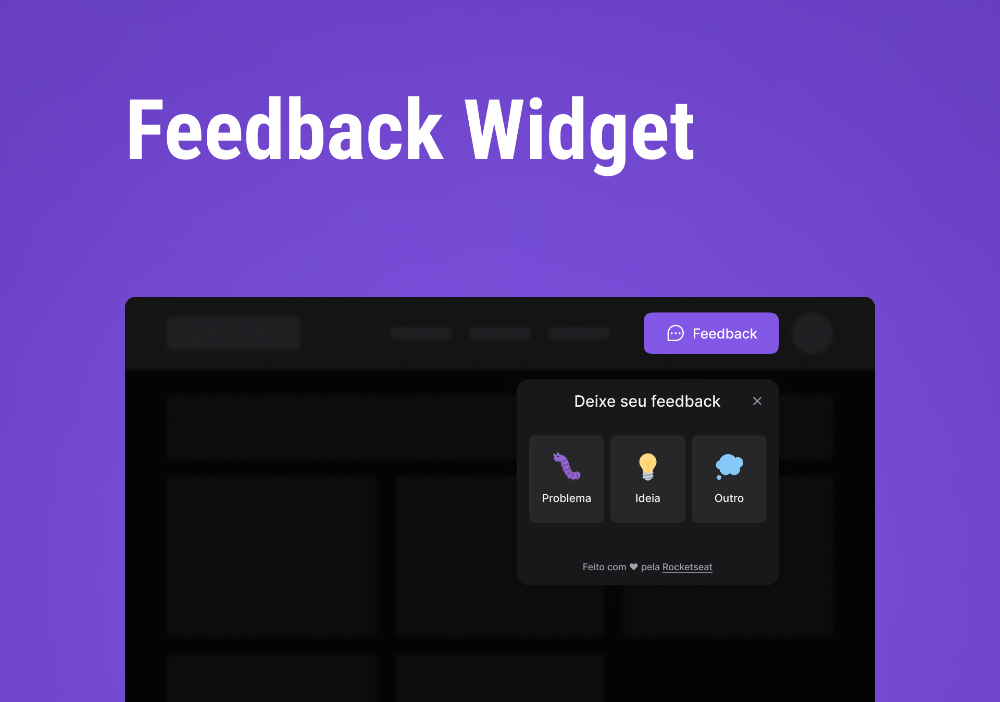

  

[Site Preview](https://nwl-return-feedback-widget.vercel.app/)

## About :checkered_flag:

This project is for collecting feedback that be can be used on any website.
The application has been split for frontend and backend.
The frontend is for submitting the feedbacks.
The backend is used for collecting the feedback and sending emails and saving feedback on the Database.

This is a project developed during Next Level Week, presented by **[Rocketseat](https://www.rocketseat.com.br)**.

## 🎯 Features

- ✔️ Submit feedbacks
- ✔️ Screenshot with html2canvas
- ✔️ Using Mailtrap for sending email with feedback.

## 🧪 Technologies

- [Node.js](https://nodejs.org)
- [React](https://reactjs.org)
- [Tailwindcss](https://tailwindcss.com)
- [Vite](https://vitejs.dev)
- [TypeScript](https://www.typescriptlang.org)
- [Express](https://expressjs.com)
- [Prisma](https://www.prisma.io)
- [PostgreSQL](https://www.postgresql.org)
- [Jest](https://jestjs.io)
